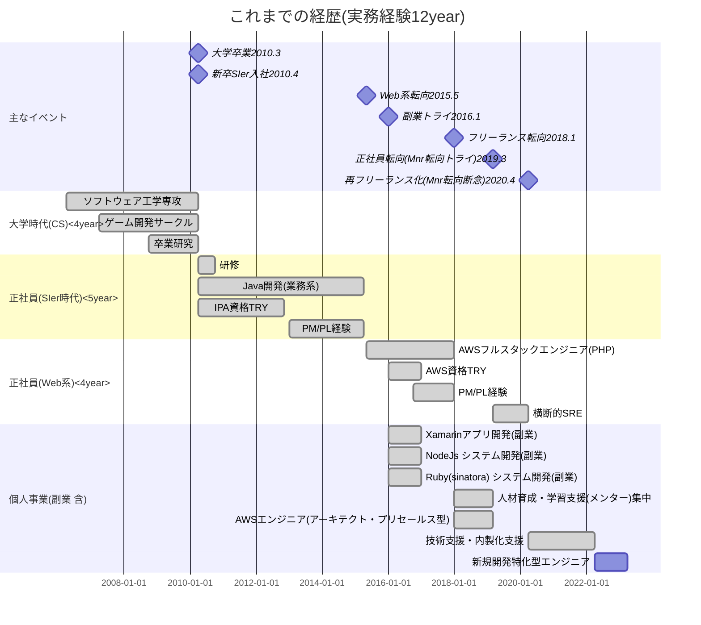

<meta http-equiv='Content-Type' content='text/html; charset=utf-8' />

----

## はじめまして

## 自己紹介

- アクセスいただきありがとうございます。藤川と申します。

- 個人事業でITエンジニアをやっています
  - 大学はソフトウェア工学、ストレートに入学・卒業
  - 東京でIT系企業に就職。
  - 実務経験は今年で12年目

- 過去に参画した個別の案件は、スキルシートを参照ください。
  - ２０１５年頃にWeb系の業界に転向して以来は、AWS系の案件に関わる
  - 色々やっているな、という印象を持たれると思います(実際背伸びしてやっていました.. )
  - 最後にやっていた開発案件は?
    - LINEのサービス開発
      - Backend: PHP Laravel7, 8
      - Frontend: React
      - Infra: AWS API Gateway/ Serverless / Event Bridge / Aurora Serverless / DynamoDB / SQS

- 今やりたいこと
    - フルスタックで、フロントも含めて(できれば新規の)開発に関われる案件を探しています
- 余談
    - 今興味があるのは何?
      - Typescript/Javascript
        - NestJs https://nestjs.com/
        - Remix https://remix.run/
        - React https://reactjs.org/
          - ロジックの分離と再利用性の向上 したい
      - ITリテラシーを持続的に向上する
        - https://github.com/Eigo-Mt-Fuji/portfolio-2022/blob/main/docs/README-%E6%95%99%E9%A4%8A-%E5%BA%A7%E5%AD%A6-%E5%AE%9F%E7%94%A8IT%E3%83%AA%E3%83%86%E3%83%A9%E3%82%B7%E3%83%BC.md
      - Blockchain使いたい (LINEブロックチェーンで遊ぶ)
        - https://github.com/Eigo-Mt-Fuji/portfolio-2022/blob/main/docs/README-%E7%89%B9%E8%A8%AD%E3%83%BBLINE%E3%83%96%E3%83%AD%E3%83%83%E3%82%AF%E3%83%81%E3%82%A7%E3%83%BC%E3%83%B3.md

## [スキルシート](./e-fujikawa-engineer.pdf)

## 経歴(時系列チャート)

- 簡単にまとめました。経歴書の補足情報として合わせて参照くださいませ

## どのようなポジションを目指すかの検討

- フルスタックエンジニア。
    - 得意(希望)技術はAWS, Typescript/React。それ以外は要相談 
        - つぎにPHP Laravel, Pythonが候補
        - C# / Javaは過去の案件で経験がありますが、基本的にお引き受けしない
    - エンジニアの役割細分化しない(柔軟対応派)
    - フリーランスのうちは、マネジメントロールにはしない。
    - チームの人数が少数でフルスタックエンジニアとしての経験を活かせると良い。
    - AWSの知識・スキルが求められる環境。
    - エンジニアのバックグラウンドを生かして、すこし上流に関わっていきたい。
        - 現在の案件では、内製化を支援しつつ、要件の確認を含めて上流からエンジニアとして参画していた。
    - 週５の参加は可能。（案件内容や条件によってご相談させてください）
    - 未経験言語への抵抗はありません
    - マネジメント経験・マネジメント能力は、平均程度と思います。５名程度のメンバーで構成されたプロジェクト管理の経験はあります。
    - エンジニアに関わらず対話は可能なタイプの人材です。現在の案件でも、セールスやボード・エンジニアのリーダー層とのやり取りをしながら進行しています。
    - 基本的にプロジェクト形式の参加が希望です(キャリア形成の観点から、期待された結果を出すまでの期間が長くても2年未満になると望ましい)

- 新規開発もやっていてリニューアルの課題も抱えている企業がタゲット
   - 開発からエンジニアとして参画、
   - 経験をフルに活かせる可能性が高くなる
   - 実際のはたらき見合いで、フリーランスでも新規開発に参加させてくれるお客様(任せてくれる方は希少だと思いますが)

