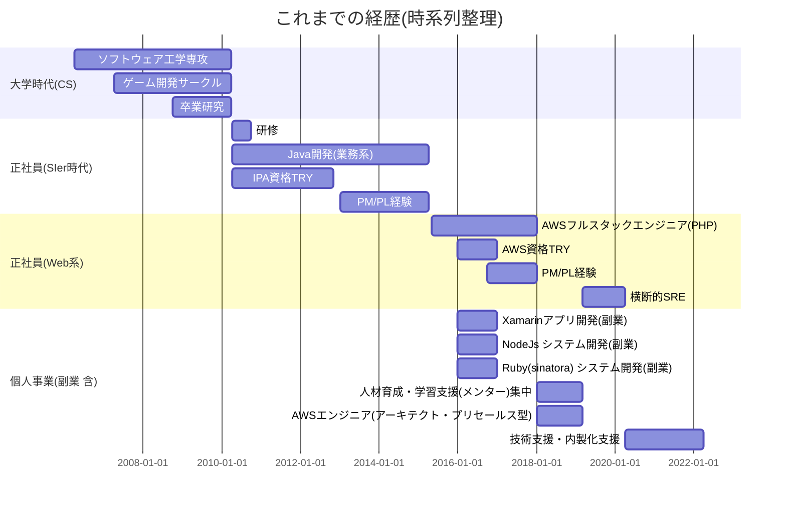

<meta http-equiv='Content-Type' content='text/html; charset=utf-8' />

----

## はじめまして

* アクセスいただきありがとうございます。藤川と申します。
* 本サイトでは、お仕事の経歴書類をPDF形式で公開しております。

## [職務経歴書](./e-fujikawa-engineer.pdf)

## 経歴(時系列チャート)

- 簡単にまとめました。経歴書の補足情報として合わせて参照くださいませ

## どのようなポジションを目指すかの検討

- フルスタックエンジニア。
    - 得意(希望)技術はAWS, Typescript/React。それ以外は要相談 
        - つぎにPHP Laravel, Pythonが候補
        - C# / Javaは過去の案件で経験がありますが、基本的にお引き受けしない
    - エンジニアの役割細分化しない(柔軟対応派)
    - フリーランスのうちは、マネジメントロールにはしない。
    - チームの人数が少数でフルスタックエンジニアとしての経験を活かせると良い。
    - AWSの知識・スキルが求められる環境。
    - エンジニアのバックグラウンドを生かして、すこし上流に関わっていきたい。
        - 現在の案件では、内製化を支援しつつ、要件の確認を含めて上流からエンジニアとして参画していた。
    - 週５の参加は可能。（案件内容や条件によってご相談させてください）
    - 未経験言語への抵抗はありません
    - マネジメント経験・マネジメント能力は、平均程度と思います。５名程度のメンバーで構成されたプロジェクト管理の経験はあります。
    - エンジニアに関わらず対話は可能なタイプの人材です。現在の案件でも、セールスやボード・エンジニアのリーダー層とのやり取りをしながら進行しています。
    - 基本的にプロジェクト形式の参加が希望です(キャリア形成の観点から、期待された結果を出すまでの期間が長くても2年未満になると望ましい)

- 新規開発もやっていてリニューアルの課題も抱えている企業がタゲット
   - 開発からエンジニアとして参画、
   - 経験をフルに活かせる可能性が高くなる
   - 実際のはたらき見合いで、フリーランスでも新規開発に参加させてくれるお客様(任せてくれる方は希少だと思いますが)

